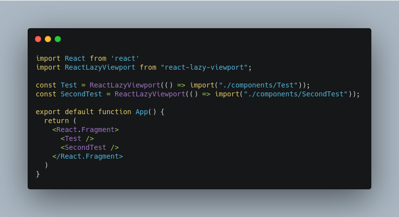
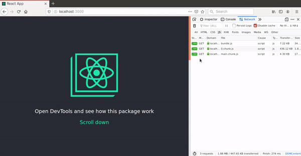

# React Lazy Viewport

[](https://github.com/adibfirman/react-lazy-viewport/pulls)
[](https://badge.fury.io/js/react-lazy-viewport)
[](https://bundlephobia.com/result?p=react-lazy-viewport@latest)
[](https://bundlephobia.com/result?p=react-lazy-viewport@latest)

Load your React Component based on viewport, this library using [Intersection Observer](https://developer.mozilla.org/en-US/docs/Web/API/IntersectionObserver) if your app targeting to not modern browser please adding this [Polyfill](https://www.npmjs.com/package/intersection-observer).

## Features

- [x] Type safe
- [ ] Preload component
- [x] SSR Support

## Instalation

```
$ yarn add react-lazy-viewport
$ npm i react-lazy-viewport
```

## Demo

We assume we have some code like this.<br/>
<br/>
and then if you open the dev tools, the file will be loaded based on viewport


## Contribute & Help

- Fork and send Pull Requests are welcome
- Submit an issues
- A new feature requests

## License

This library is [MIT licensed](https://github.com/adibfirman/react-lazy-viewport/blob/master/LICENSE)
